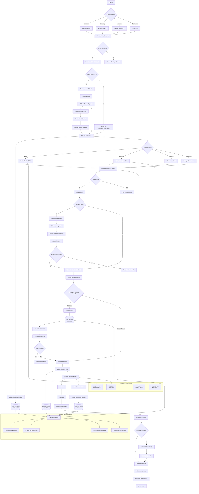

# Diagrama de Flujo: Proceso Completo de Cotización y Venta

## Visión General del Proceso

Este diagrama muestra el flujo completo desde que un cliente solicita una cotización hasta la entrega final del vehículo, incluyendo todos los módulos del sistema que intervienen.



## Descripción Detallada del Flujo

### 1. Entrada del Cliente
- **Múltiples canales**: Web, WhatsApp, teléfono, presencial
- **Captura inicial**: Información básica del cliente y auto de interés

### 2. Búsqueda y Pricing
- **Verificación de inventario**: Buscar auto específico solicitado
- **Pricing inteligente**: Si el auto existe, calcular precio sugerido
- **Comparables**: Obtener datos de mercado similares
- **Simulación**: Estimar tiempo de venta y probabilidad

### 3. Generación de Cotización
- **PDF personalizado**: Con precio, características, comparables
- **Múltiples formatos**: Email, WhatsApp, físico
- **Registro en BD**: Historial completo de cotizaciones

### 4. Negociación Interactiva
- **Simulador en tiempo real**: Cliente puede probar diferentes precios
- **Impacto visual**: Ver cómo cambia tiempo de venta y margen
- **Negociación guiada**: Sistema sugiere precios óptimos

### 5. Reserva y Compra
- **Reserva temporal**: Mantener auto apartado
- **Pago inicial**: Confirmación de seriedad del cliente
- **Transición a venta**: Una vez confirmado el pago

### 6. Proceso de Venta
- **Documentación legal**: Facturas, contratos, transferencias
- **Actualización de inventario**: Marcar auto como vendido
- **Coordinación de entrega**: Fecha y logística

### 7. Seguimiento y Analytics
- **Dashboard administrativo**: Visión completa de todas las etapas
- **Métricas de conversión**: De cotización → reserva → venta
- **Historial completo**: Seguimiento de cada lead

## Módulos del Sistema Involucrados

### Backend (FastAPI)
- **API de Autos**: Búsqueda y detalles de inventario
- **API de Pricing**: Análisis inteligente de precios
- **API de Cotizaciones**: Gestión de leads y seguimiento
- **API de Ventas**: Procesamiento de transacciones

### Base de Datos
- **autos**: Inventario disponible
- **clientes**: Información de compradores
- **cotizaciones**: Historial de consultas
- **reservas**: Autos apartados temporalmente
- **ventas**: Transacciones completadas
- **market_listings**: Datos de mercado para pricing

### Frontend (Next.js)
- **Catálogo público**: Búsqueda de autos
- **Formulario de cotización**: Captura de leads
- **Dashboard admin**: Gestión completa del proceso
- **Simulador interactivo**: Negociación en tiempo real

### Servicios Externos
- **Cloudinary**: Gestión de imágenes de autos
- **WhatsApp API**: Comunicación automatizada
- **Email Service**: Notificaciones formales
- **CRM**: Historial completo de interacciones

## Puntos Críticos del Proceso

### Conversiones Clave
1. **Cotización → Reserva**: Tasa objetivo >20%
2. **Reserva → Venta**: Tasa objetivo >80%
3. **Tiempo promedio**: Cotización → venta en <30 días

### Automatización
- **Cotizaciones**: 100% automatizadas con pricing inteligente
- **Seguimiento**: Recordatorios automáticos
- **Documentación**: Generación automática de PDFs

### Métricas de Éxito
- **Tasa de respuesta**: <2 horas a consultas
- **Conversión total**: >15% cotizaciones → ventas
- **Satisfacción**: >4.5/5 en encuestas post-venta

## Casos Especiales

### Auto No Disponible
```
Cliente pide auto X
    ↓
No encontrado en inventario
    ↓
Buscar en proveedores/mercado
    ↓
Generar cotización "bajo pedido"
    ↓
Coordinar importación/compra
```

### Negociación Compleja
```
Cliente quiere precio especial
    ↓
Usar simulador interactivo
    ↓
Mostrar impacto en tiempo de venta
    ↓
Ofrecer alternativas (trade-in, financiamiento)
    ↓
Negociación guiada por sistema
```

### Reserva Expirada
```
Reserva creada
    ↓
Pago no realizado en plazo
    ↓
Sistema envía recordatorios automáticos
    ↓
Después de 7 días: liberar reserva
    ↓
Auto vuelve a disponible
```

Este diagrama representa el flujo completo del sistema de concesionario, desde la primera consulta del cliente hasta la entrega final del vehículo, integrando todos los módulos desarrollados (pricing inteligente, simulador, inventario, etc.).</content>
<parameter name="filePath">c:\Users\PCJuan\Desktop\ConcesionariosCloud\docs\diagrama-flujo-completo.md