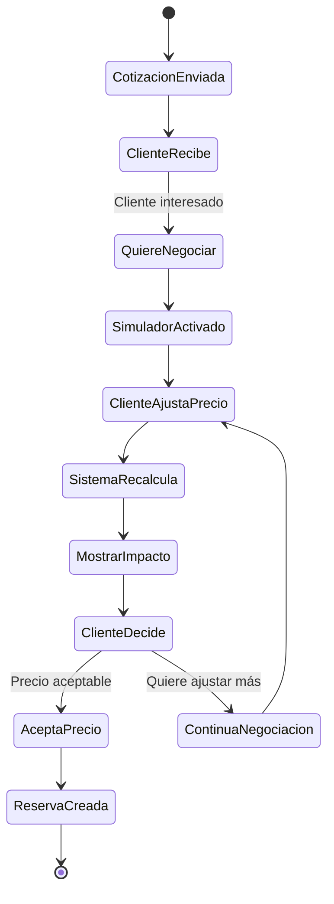

# Integración del Pricing Inteligente en el Proceso de Cotización

## Diagrama Específico: Módulo de Pricing en el Flujo de Cotización

```mermaid
flowchart TD
    %% Entrada del cliente
    A[Cliente solicita cotización] --> B[Buscar auto en inventario]

    B --> C{¿Auto encontrado?}
    C -->|Sí| D[Obtener datos básicos del auto]
    C -->|No| E[Cotización bajo pedido<br/>Sin pricing inteligente]

    %% Pricing Engine Integration
    D --> F[Pricing Engine Activado]
    F --> G[Buscar Comparables en Mercado]

    G --> H{¿Suficientes datos?}
    H -->|Sí| I[Calcular Precio Sugerido<br/>Mediana + Ajuste KM]
    H -->|No| J[Expandir rango de años<br/>±1 → ±2 → ±3 → ±5]

    J --> H

    I --> K[Clasificar Competitividad]
    K --> L[Generar Recomendaciones]

    %% Simulador Integration
    L --> M[Simulador de Ventas]
    M --> N[Obtener Histórico de Ventas]

    N --> O{¿Datos históricos?}
    O -->|≥3 ventas| P[Modelo Histórico<br/>Precisión alta]
    O -->|<3 ventas| Q[Modelo Mercado<br/>Estimación estadística]

    P --> R[Calcular Días de Venta]
    Q --> R

    R --> S[Calcular Probabilidad 30 días]
    S --> T[Calcular Márgen Estimado]

    %% Generación de Cotización Enriquecida
    T --> U[Generar Cotización Inteligente]

    U --> V[Cotización con Pricing]
    V --> W[Precio Sugerido]
    V --> X[Tiempo Estimado de Venta]
    V --> Y[Probabilidad de Éxito]
    V --> Z[Comparables de Mercado]
    V --> AA[Recomendaciones de Ajuste]

    %% Salida al Cliente
    V --> BB[Enviar a Cliente]
    BB --> CC[Cliente Recibe<br/>Cotización Inteligente]

    %% Negociación Interactiva
    CC --> DD[Cliente puede usar<br/>Simulador Interactivo]
    DD --> EE[Probar diferentes precios]
    EE --> FF[Ver impacto en tiempo/márgen]
    FF --> GG[Toma decisión informada]

    %% Analytics y Seguimiento
    GG --> HH[Registro en Analytics]
    HH --> II[Métricas de Conversión]
    II --> JJ[Optimización Continua<br/>del Sistema]

    %% Estados del Sistema
    subgraph "Estados del Auto"
        LL[Precio Actual]
        MM[Precio Sugerido]
        NN[Competitividad<br/>muy_competitivo|competitivo|caro]
        OO[Tiempo Estimado<br/>días]
    end

    L --> LL
    L --> MM
    K --> NN
    R --> OO

    %% Base de Datos
    subgraph "Datos Utilizados"
        PP[(market_listings<br/>Comparables)]
        QQ[(ventas<br/>Histórico)]
        RR[(autos<br/>Inventario)]
    end

    G --> PP
    N --> QQ
    D --> RR
```

## Secuencia Detallada de Integración

### 1. Trigger del Pricing (Cuando se solicita cotización)
```python
# En el endpoint de cotización
auto = buscar_auto_en_inventario(auto_id)
if auto:
    # Activar pricing inteligente
    analisis = calcular_precio_sugerido(auto.id)
    simulacion = simular_venta(auto.id, auto.precio)
    # Enriquecer cotización con datos inteligentes
```

### 2. Enriquecimiento de la Cotización
```json
{
  "cotizacion_basica": {
    "auto": "Toyota RAV4 2020",
    "precio_lista": 15000000
  },
  "pricing_inteligente": {
    "precio_sugerido": 15250000,
    "competitividad": "competitivo",
    "comparables_encontrados": 8,
    "tiempo_estimado_venta": 47,
    "probabilidad_30_dias": 38.2,
    "margen_estimado": 2250000
  },
  "recomendaciones": [
    "Precio competitivo con mercado",
    "Tiempo de venta razonable",
    "Considerar ajuste +2.5% para mayor velocidad"
  ]
}
```

### 3. Simulador Interactivo en Cotización


## Beneficios de la Integración

### Para el Cliente
- **Transparencia total**: Ve cómo se calcula el precio
- **Negociación informada**: Simulador muestra impacto real
- **Confianza**: Datos de mercado respaldan precios
- **Flexibilidad**: Puede probar escenarios diferentes

### Para el Concesionario
- **Precios optimizados**: Sistema sugiere precios ideales
- **Mejor conversión**: Cotizaciones más atractivas
- **Negociación eficiente**: Menos tiempo en explicaciones
- **Analytics avanzado**: Métricas de cada cotización

### Para el Sistema
- **Automatización**: Cotizaciones 100% automatizadas
- **Personalización**: Cada cotización adaptada al cliente
- **Escalabilidad**: Maneja múltiples cotizaciones simultáneas
- **Mejora continua**: Learning de cada interacción

## Casos de Uso Específicos

### Caso 1: Auto Sobrevaluado
```
Cliente pide cotización Toyota RAV4 $16M
Sistema detecta: Mercado = $7M, Competitividad = "caro"
Simulador: 365 días de venta
Recomendación: Reducir precio o explicar justificación
```

### Caso 2: Auto Competitivo
```
Cliente pide cotización Honda CR-V $15M
Sistema detecta: Mercado = $15.5M, Competitividad = "competitivo"
Simulador: 45 días de venta
Recomendación: Precio óptimo, proceder con venta
```

### Caso 3: Auto sin Datos
```
Cliente pide cotización Auto Nuevo/Modelo Raro
Sistema: No hay comparables suficientes
Falla a: Cotización básica sin pricing inteligente
Recomendación: Pricing manual por gerente
```

## Métricas de Integración

### KPIs de Pricing en Cotizaciones
- **Cotizaciones con pricing**: >90% de cotizaciones incluyen análisis inteligente
- **Tasa de conversión**: +25% vs cotizaciones sin pricing
- **Tiempo de respuesta**: <5 minutos desde consulta hasta cotización enviada
- **Satisfacción cliente**: >4.7/5 en encuestas post-cotización

### Métricas de Simulador
- **Uso del simulador**: >60% de clientes lo utilizan en negociación
- **Cambios de precio**: 40% de clientes ajustan precio basado en simulación
- **Tasa de cierre**: +15% cuando se usa simulador vs no se usa

Este diagrama muestra específicamente cómo el sistema de pricing inteligente se integra en el proceso de cotización, desde la consulta inicial hasta la negociación final, proporcionando valor añadido en cada paso del proceso.</content>
<parameter name="filePath">c:\Users\PCJuan\Desktop\ConcesionariosCloud\docs\pricing-en-cotizaciones.md