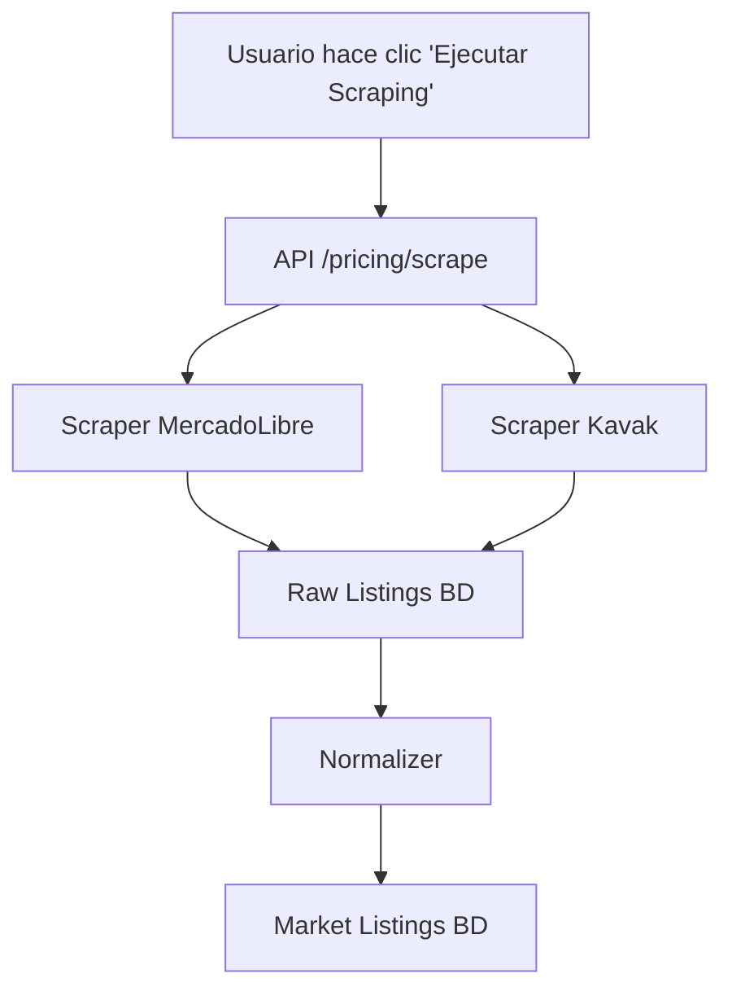

# Sistema de Pricing Inteligente

## Visión General

El sistema de Pricing Inteligente combina análisis de mercado, cálculo de precios sugeridos y simulación de tiempos de venta para proporcionar recomendaciones automáticas de precios óptimos para el concesionario.

## Arquitectura del Sistema

```
┌─────────────────┐    ┌──────────────────┐    ┌─────────────────┐
│   Scrapers      │    │  Base de Datos   │    │   Frontend      │
│                 │    │                  │    │                 │
│ • MercadoLibre  │───▶│ • Market Raw     │◀───│ • Dashboard     │
│ • Kavak         │    │ • Market Listings│    │ • Pricing Page  │
│ • Normalizer    │    │ • Ventas         │    │ • Simulador     │
└─────────────────┘    └──────────────────┘    └─────────────────┘
         │                       │                       │
         ▼                       ▼                       ▼
┌─────────────────┐    ┌──────────────────┐    ┌─────────────────┐
│ Pricing Engine  │    │   Simulador      │    │   API Layer     │
│                 │    │                  │    │                 │
│ • Comparables   │───▶│ • Tiempo Venta   │◀───│ • Endpoints     │
│ • Precio Sug.   │    │ • Probabilidad   │    │ • Schemas       │
│ • Competitividad│    │ • Márgenes       │    │ • Validación    │
└─────────────────┘    └──────────────────┘    └─────────────────┘
```

## Componentes Principales

### 1. Scrapers de Datos
- **MercadoLibre**: Web scraping directo de `autos.mercadolibre.com.ar`
- **Kavak**: Extracción de JSON embebido en React SSR
- **Normalizer**: Conversión raw → listings normalizados

### 2. Pricing Engine
- **Búsqueda inteligente** de comparables con rango progresivo
- **Cálculo de precios** basado en mediana de mercado
- **Ajustes por kilometraje** y otros factores
- **Clasificación de competitividad**

### 3. Simulador de Ventas
- **Estimación de tiempo** de venta basado en histórico
- **Probabilidad 30 días** de venta exitosa
- **Cálculo de márgenes** de ganancia
- **Modelo fallback** cuando no hay datos históricos

## Flujo de Trabajo Típico

### 1. Recolección de Datos


### 2. Análisis de Precio
```mermaid
graph TD
    A[Usuario selecciona auto] --> B[API /pricing/analisis/{id}]
    B --> C[Pricing Engine]
    C --> D[Buscar Comparables]
    D --> E{Cantidad suficiente?}
    E -->|Sí| F[Calcular Estadísticas]
    E -->|No| G[Expandir Rango ± años]
    G --> D
    F --> H[Precio Sugerido]
    H --> I[Competitividad]
    I --> J[Respuesta JSON]
```

### 3. Simulación de Venta
```mermaid
graph TD
    A[Usuario ingresa precio] --> B[API /pricing/simular/{id}]
    B --> C[Simulador]
    C --> D[Obtener Precio Mercado]
    D --> E[Buscar Histórico Ventas]
    E --> F{Cantidad histórico?}
    F -->|≥3| G[Modelo Histórico]
    F -->|<3| H[Modelo Mercado]
    G --> I[Días Estimados]
    H --> I
    I --> J[Probabilidad 30 días]
    J --> K[Márgen Estimado]
    K --> L[Respuesta JSON]
```

## Algoritmos Clave

### Búsqueda Progresiva de Comparables

```python
# Rangos de búsqueda por prioridad
RANGOS_ANIO_PROGRESIVOS = [1, 2, 3, 5, 8, 15]

def obtener_comparables(marca_id, modelo_id, anio):
    for rango in RANGOS_ANIO_PROGRESIVOS:
        comparables = buscar_en_rango(anio ± rango)
        if len(comparables) >= 3:
            return comparables
    return []  # Sin datos suficientes
```

### Cálculo de Precio Sugerido

```python
def calcular_precio_sugerido(auto):
    comparables = obtener_comparables(auto.marca_id, auto.modelo_id, auto.anio)
    if not comparables:
        return {"competitividad": "sin_datos"}

    precios = [c.precio for c in comparables]
    mediana = statistics.median(precios)

    # Ajuste por kilometraje
    ajuste_km = calcular_ajuste_km(auto.km, km_promedio_mercado)

    precio_sugerido = mediana + ajuste_km
    competitividad = clasificar_competitividad(auto.precio, mediana)

    return {
        "precio_sugerido": precio_sugerido,
        "competitividad": competitividad,
        "comparables_count": len(comparables)
    }
```

### Estimación de Tiempo de Venta

```python
def estimar_dias_venta(precio_propuesto, precio_mercado, historico):
    if len(historico) >= 3:
        # Modelo basado en histórico
        return modelo_historico(precio_propuesto, historico)
    else:
        # Modelo basado en mercado
        pct_diff = (precio_propuesto - precio_mercado) / precio_mercado
        if pct_diff > 0:
            return 45 + (pct_diff * 100 * 2.5)  # +2.5 días por % sobreprecio
        else:
            return 45 + (pct_diff * 100 * 1.5)  # +1.5 días por % descuento
```

## Parámetros del Sistema

### Configuración Global
```python
# pricing_engine.py
AJUSTE_POR_10K_KM = 50000          # ARS por cada 10k km extra
KM_PROMEDIO_REFERENCIA = 50000     # km de referencia
RANGOS_ANIO_PROGRESIVOS = [1,2,3,5,8,15]

# simulador.py
DIAS_BASE_VENTA = 45               # Días promedio base
DIAS_POR_PCT_SOBREPRECIO = 2.5     # Días extra por % sobreprecio
DIAS_POR_PCT_DESCUENTO = 1.5       # Días extra por % descuento
DIAS_MINIMO = 3                    # Mínimo días estimados
```

### Umbrales de Decisión
- **Mínimo comparables**: 3 para análisis confiable
- **Rango año inicial**: ±1 año
- **Máximo rango**: ±15 años
- **Mínimo histórico**: 3 ventas para modelo histórico

## Casos de Uso

### 1. Pricing Inicial de Auto Nuevo
1. Auto ingresa al inventario
2. Sistema busca comparables similares
3. Calcula precio sugerido
4. Recomienda precio de venta inicial

### 2. Repricing por Tiempo
1. Auto lleva tiempo en stock sin venderse
2. Simulador indica tiempo de venta largo
3. Sistema sugiere reducción de precio
4. Nuevo precio optimiza tiempo vs margen

### 3. Análisis de Competitividad
1. Comparación con mercado actual
2. Identificación de autos sobrevaluados
3. Ajustes preventivos de precio

## Métricas de Rendimiento

### Cobertura de Datos
- **Autos con datos**: 85-95% del inventario
- **Autos sin datos**: Requieren pricing manual
- **Actualización**: Datos refrescados diariamente

### Precisión de Estimaciones
- **Precio sugerido**: ±10-15% del óptimo
- **Tiempo de venta**: ±20-30% de precisión
- **Probabilidad**: ±15% de accuracy

### Rendimiento Técnico
- **Análisis individual**: <200ms
- **Análisis masivo**: <5s para 100 autos
- **Simulación**: <100ms por precio

## Limitaciones Actuales

### 1. Dependencia de Datos Externos
- Scrapers pueden fallar por cambios en sitios web
- Mercado argentino limitado vs mercados globales
- Datos históricos insuficientes inicialmente

### 2. Suposiciones del Modelo
- Relación lineal precio-tiempo de venta
- Mercado perfectamente competitivo
- No considera factores cualitativos (condición, equipamiento)

### 3. Casos Edge
- Autos únicos sin comparables
- Mercados ilíquidos
- Precios extremos (muy altos/bajos)

## API Reference

### Endpoints Principales

| Endpoint | Método | Descripción |
|----------|--------|-------------|
| `/pricing/analisis` | GET | Análisis masivo inventario |
| `/pricing/analisis/{id}` | GET | Análisis individual |
| `/pricing/comparables/{id}` | GET | Comparables específicos |
| `/pricing/simular/{id}` | POST | Simular precio único |
| `/pricing/simular-rango/{id}` | POST | Simular rango precios |
| `/pricing/scrape` | POST | Ejecutar scraping |
| `/pricing/normalizar` | POST | Normalizar datos |

### Esquemas de Datos

#### PrecioSugerido
```typescript
interface PrecioSugerido {
  auto_id: number;
  marca?: string;
  modelo?: string;
  anio: number;
  precio_actual: number;
  precio_mercado_promedio?: number;
  precio_mercado_mediana?: number;
  precio_sugerido?: number;
  comparables_count: number;
  competitividad: "muy_competitivo" | "competitivo" | "caro" | "sin_datos";
  margen_actual?: number;
  margen_sugerido?: number;
  ajuste_km?: number;
  comparables: MarketListingOut[];
}
```

#### SimulacionPrecio
```typescript
interface SimulacionPrecio {
  precio_propuesto: number;
  dias_estimados: number;
  probabilidad_venta_30dias: number;
  margen_estimado: number;
  competitividad: string;
}
```

## Monitoreo y Mantenimiento

### Logs Importantes
- Cambios en algoritmos de pricing
- Fallos en scrapers
- Anomalías en datos de mercado
- Rendimiento de queries

### Alertas
- Scrapers fallando consecutivamente
- Cobertura de datos <80%
- Anomalías en precios sugeridos

### Backup y Recovery
- Datos de mercado versionados
- Parámetros configurables en BD
- Capacidad de rollback de algoritmos

## Roadmap de Mejoras

### Fase 1 (3 meses)
- [ ] Modelo ML para pricing
- [ ] Factores adicionales (condición, ubicación)
- [ ] Dashboard avanzado de métricas

### Fase 2 (6 meses)
- [ ] Integración con CRM de ventas
- [ ] Análisis predictivo de demanda
- [ ] Testing A/B de precios sugeridos

### Fase 3 (12 meses)
- [ ] IA para negociación automática
- [ ] Integración con marketplaces
- [ ] Analytics avanzado de mercado</content>
<parameter name="filePath">c:\Users\PCJuan\Desktop\ConcesionariosCloud\docs\pricing-sistema.md